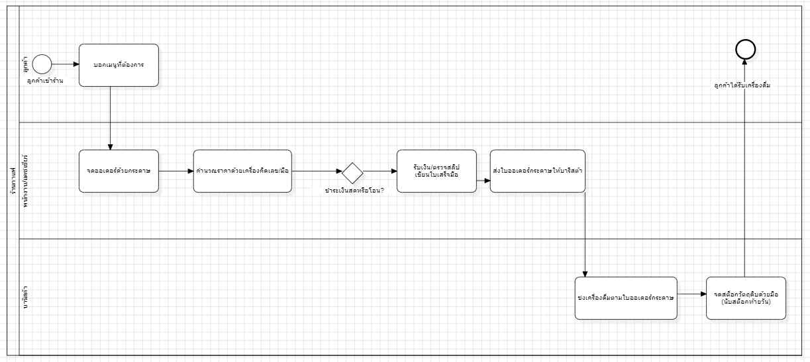
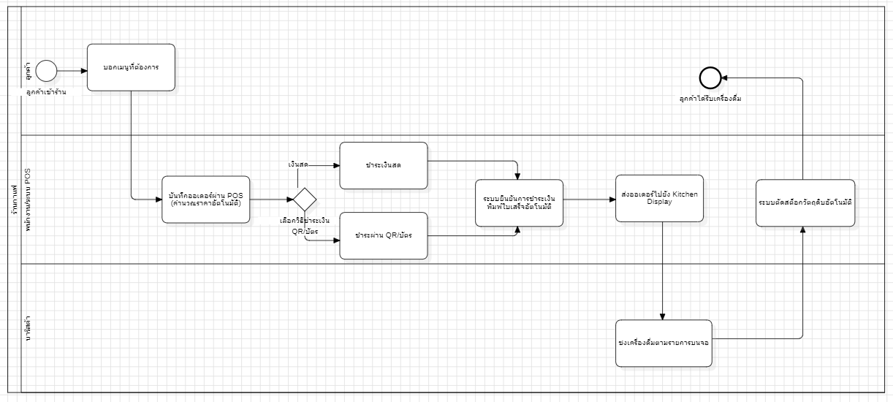

# wk02-feasibility-report.md

## โครงงาน: ระบบจัดการร้านกาแฟ (Cafe Ordering System) — เครือร้าน 3 สาขา

**ทีมพัฒนา:** นพพร บุญรอด (Project Lead/PM) · วชิรวิทย์ น้อมเจริญ (BA/SA) · นฤปนาท รื่นเริงใจ (Designer UML/DB) · ศตพร ขาวนก (Developer) · ชลทรัพย์ ชินปฐมพงค์ (Presenter/Documenter)

---

## ส่วนที่ 1: รายงานความเป็นไปได้ (Feasibility Study)

### 1. ภาพรวมโครงการ

| หัวข้อ | รายละเอียด |
|---|---|
| ชื่อระบบ | ระบบ POS ร้านกาแฟ (Cafe Ordering System) จำนวน 3 สาขา |
| วัตถุประสงค์ | ลดเวลาและความผิดพลาดในการรับออเดอร์/คิดเงิน, ตัดสต็อกวัตถุดิบอัตโนมัติ, สรุปยอดขายแบบเรียลไทม์ทั้ง 3 สาขา |
| ขอบเขตโดยสรุป | รับออเดอร์หน้าร้าน → คำนวณราคา → ชำระเงิน (สด/QR) → พิมพ์ใบเสร็จ → ส่งออเดอร์ไปครัว/บาริสต้า → ตัดสต็อกวัตถุดิบ → สรุปรายงานยอดขายรวมทุกสาขา |
| ผู้มีส่วนได้ส่วนเสียหลัก | ลูกค้า, พนักงานหน้าร้าน/บาริสต้า, ผู้จัดการร้าน, เจ้าของธุรกิจ, ฝ่าย IT |

### 2. Technical Feasibility (ความเป็นไปได้ด้านเทคนิค)

- **เทคโนโลยีที่ใช้:** Node.js/Express (Backend), MySQL (ฐานข้อมูล), เว็บ/แอปฝั่งหน้าร้าน (POS Client) และจอ Kitchen Display
- **ความพร้อมของทีม:** ทีมมีความรู้ Node.js/Express และ MySQL ในระดับปานกลาง เพียงพอต่อการเริ่มพัฒนา MVP แต่ยังต้องศึกษาเพิ่มเติมด้าน API ของผู้ให้บริการ QR payment
- **ความเสี่ยงด้านเทคนิค:**
  - การเชื่อมต่อเครื่องพิมพ์ใบเสร็จและเครื่องสแกน QR/บาร์โค้ดกับหลายสาขาพร้อมกัน
  - การซิงค์ข้อมูลสต็อกและยอดขายแบบเรียลไทม์ระหว่าง 3 สาขากับส่วนกลาง (Cloud/Server)
  - ความเสถียรของอินเทอร์เน็ตในแต่ละสาขาเมื่อระบบต้องออนไลน์ตลอดเวลา
- **สรุป:** มีความเป็นไปได้ด้านเทคนิค แต่ควรเผื่อเวลาฝึกอบรมทีมด้าน payment API และทดสอบการเชื่อมต่อฮาร์ดแวร์ก่อนขึ้นระบบจริงทุกสาขา

### 3. Economic Feasibility (ความเป็นไปได้ด้านเศรษฐศาสตร์)

| รายการ | ประมาณการ |
|---|---|
| ต้นทุนครั้งเดียว (one-time) | ค่าพัฒนาระบบ + อุปกรณ์ (แท็บเล็ต/เครื่องพิมพ์ใบเสร็จ/เครื่องสแกน) รวมประมาณ 90,000 บาท (30,000 บาท/สาขา × 3 สาขา) |
| ต้นทุนต่อเนื่อง (recurring) | ค่าเช่า Server/Cloud, ค่าธรรมเนียม QR payment, ค่าบำรุงรักษาระบบ ประมาณ 3,000–5,000 บาท/เดือน |
| ผลประโยชน์จับต้องได้ (tangible) | ลดเวลาคิดเงิน/ปิดยอดวันละ 30 นาทีต่อสาขา, ลดความผิดพลาดจากการตัดสต็อกด้วยมือ |
| ผลประโยชน์จับต้องไม่ได้ (intangible) | ภาพลักษณ์ร้านที่ทันสมัยขึ้น, ความพึงพอใจของลูกค้าจากความรวดเร็วและใบเสร็จที่ถูกต้อง |
| ระยะเวลาคืนทุนโดยประมาณ | ประมาณ 6–8 เดือนต่อสาขา จากการลดต้นทุนแรงงานและความผิดพลาดในการตัดสต็อก |

**สรุป:** ต้นทุนโดยรวมของ 3 สาขาอยู่ในระดับที่เจ้าของธุรกิจรับได้ และผลประโยชน์ที่ได้ (ลดเวลา ลดของผิดพลาด ข้อมูลยอดขายรวมทุกสาขาแบบเรียลไทม์) คุ้มค่ากับการลงทุนในระยะ 6–8 เดือน

### 4. Operational Feasibility (ความเป็นไปได้ด้านการปฏิบัติงาน)

- พนักงานหน้าร้านและบาริสต้าในแต่ละสาขา (รวมประมาณ 4 คน/สาขา) ต้องฝึกอบรมใช้ระบบ POS และจอ Kitchen Display ประมาณ 2 ชั่วโมง/สาขา
- พนักงานที่คุ้นเคยกับการจดออเดอร์ด้วยกระดาษอาจต้องใช้เวลาปรับตัวช่วงแรก โดยเฉพาะพนักงานที่ไม่คุ้นเคยหน้าจอสัมผัส จึงควรออกแบบ UI ให้ใช้งานง่าย ปุ่มใหญ่ ขั้นตอนไม่ซับซ้อน
- ผู้จัดการร้านและเจ้าของธุรกิจสนับสนุนการเปลี่ยนแปลงเต็มที่ เนื่องจากเห็นประโยชน์ชัดเจนด้านการควบคุมสต็อกและยอดขายรวมทุกสาขา
- ควรมีช่วง Pilot ทดลองใช้ระบบใน 1 สาขาก่อน แล้วค่อยขยายไปอีก 2 สาขา เพื่อลดแรงต่อต้านการเปลี่ยนแปลง (resistance to change)

**สรุป:** มีความเป็นไปได้ด้านการปฏิบัติงาน หากมีแผนฝึกอบรมและช่วง Pilot รองรับการเปลี่ยนผ่านจากระบบกระดาษไปสู่ระบบ POS

### 5. Schedule Feasibility (ความเป็นไปได้ด้านระยะเวลา)

ทีมมีเวลาทำงานทั้งหมด 16 สัปดาห์ แบ่งได้ดังนี้:

| ช่วงสัปดาห์ | กิจกรรมหลัก |
|---|---|
| สัปดาห์ 1–4 | วิเคราะห์ความต้องการ (Requirements), ออกแบบ BPMN/UML/ER Diagram |
| สัปดาห์ 5–12 | พัฒนาระบบ (Backend, POS Client, Kitchen Display, การเชื่อมต่อ Payment) |
| สัปดาห์ 13–16 | ทดสอบระบบ (รวมการทดลอง Pilot 1 สาขา) และนำเสนอผลงาน |

**สรุป:** กรอบเวลา 16 สัปดาห์เพียงพอสำหรับขอบเขตงานที่วางไว้ หากไม่มี milestone ใดล่าช้าเกินกำหนด แผนสำรองคือลดขอบเขต (scope) ของฟีเจอร์เสริม เช่น รายงานเชิงลึกหรือแอปลูกค้า เพื่อรักษากำหนดส่งงานหลัก

### 6. ข้อสรุปโครงการ

**ควรดำเนินโครงการต่อ** เนื่องจากทั้ง 4 มิติสนับสนุนความเป็นไปได้:
- ด้านเทคนิค: ทีมมีพื้นฐานเพียงพอ แม้ต้องเรียนรู้ Payment API เพิ่ม
- ด้านเศรษฐศาสตร์: ผลประโยชน์คุ้มค่ากับต้นทุนภายใน 6–8 เดือน
- ด้านการปฏิบัติงาน: ผู้บริหารสนับสนุน และมีแผนฝึกอบรม/Pilot รองรับ
- ด้านระยะเวลา: กรอบ 16 สัปดาห์เพียงพอ พร้อมแผนสำรองหากล่าช้า

---

## ส่วนที่ 2: BPMN Diagram

### 2.1 กระบวนการสั่งเครื่องดื่ม แบบ As-Is (ปัจจุบัน — ยังไม่มีระบบ POS)

**ปัญหาของกระบวนการแบบ As-Is:** พนักงานจดออเดอร์และคำนวณราคาด้วยมือ/เครื่องคิดเลข ทำให้เสี่ยงผิดพลาดสูง การตัดสต็อกทำโดยการนับท้ายวันจึงล่าช้าและไม่แม่นยำ อีกทั้งไม่มีข้อมูลยอดขายเรียลไทม์ให้เจ้าของร้านติดตามภาพรวมทั้ง 3 สาขา

### 2.2 กระบวนการสั่งเครื่องดื่ม แบบ To-Be (หลังมีระบบ POS ที่จะพัฒนา)

**ประโยชน์ของกระบวนการแบบ To-Be:** ระบบคำนวณราคาและยืนยันการชำระเงินอัตโนมัติ ลดข้อผิดพลาดจากการคิดเงินด้วยมือ ออเดอร์ถูกส่งตรงไปยังจอ Kitchen Display ทันที และระบบตัดสต็อกวัตถุดิบอัตโนมัติ ทำให้เจ้าของร้านเห็นยอดขายและสต็อกคงเหลือแบบเรียลไทม์ทั้ง 3 สาขา

### 2.3 การเปรียบเทียบ Gateway จุดสำคัญ

Gateway "เลือกวิธีชำระเงิน" เปลี่ยนแปลงจากแบบ As-Is ที่พนักงานต้องตรวจสอบเงินสด/สลิปด้วยตาและตัดสินใจเอง ไปเป็นแบบ To-Be ที่ระบบ POS แยกเส้นทางการยืนยันการชำระเงินอัตโนมัติทั้งสองช่องทาง (เงินสด/QR) แล้วนำไปสู่ขั้นตอนพิมพ์ใบเสร็จและตัดสต็อกที่เป็นมาตรฐานเดียวกัน ลดโอกาสความผิดพลาดจากดุลยพินิจของพนักงานแต่ละคน

---

## ส่วนที่ 3: การอภิปรายผล — BPMN แบบ To-Be ช่วยแก้ปัญหาอย่างไร

**ด้าน Economic Feasibility:**
กระบวนการ To-Be ที่คำนวณราคาและตัดสต็อกอัตโนมัติ ช่วยลดต้นทุนแรงงานที่เสียไปกับการคิดเงินด้วยมือและการนับสต็อกท้ายวัน ตรงกับที่วิเคราะห์ไว้ว่าระบบสามารถคืนทุนได้ภายใน 6–8 เดือน อีกทั้งข้อมูลยอดขายเรียลไทม์ยังช่วยให้เจ้าของร้านตัดสินใจสั่งวัตถุดิบและวางแผนโปรโมชันได้แม่นยำขึ้น ซึ่งเป็นผลประโยชน์เชิงเศรษฐศาสตร์ที่จับต้องได้เพิ่มเติม

**ด้าน Operational Feasibility:**
Gateway และ Task ที่ปรับให้เป็นขั้นตอนมาตรฐานเดียวกันในระบบ POS ช่วยลดภาระการตัดสินใจของพนักงาน ทำให้ฝึกอบรมง่ายและใช้เวลาน้อยลง (ประมาณ 2 ชั่วโมงตามที่ประเมินไว้) นอกจากนี้การส่งออเดอร์ตรงไปยังจอ Kitchen Display แทนใบกระดาษยังลดความสับสนระหว่างพนักงานหน้าร้านกับบาริสต้า ซึ่งช่วยลดแรงต่อต้านการเปลี่ยนแปลงเมื่อทุกคนเห็นว่าขั้นตอนทำงานง่ายและชัดเจนขึ้นกว่าเดิม

---

## ภาคผนวก: เครื่องมือที่ใช้วาด BPMN

แผนภาพ BPMN ทั้งสองแบบจัดทำในรูปแบบ SVG ตามสัญลักษณ์มาตรฐาน BPMN (Pool/Lane, Event, Task, Gateway, Sequence Flow) อ้างอิงจากเอกสารประกอบการสอนสัปดาห์ที่ 2 และ https://camunda.com/bpmn/reference/
