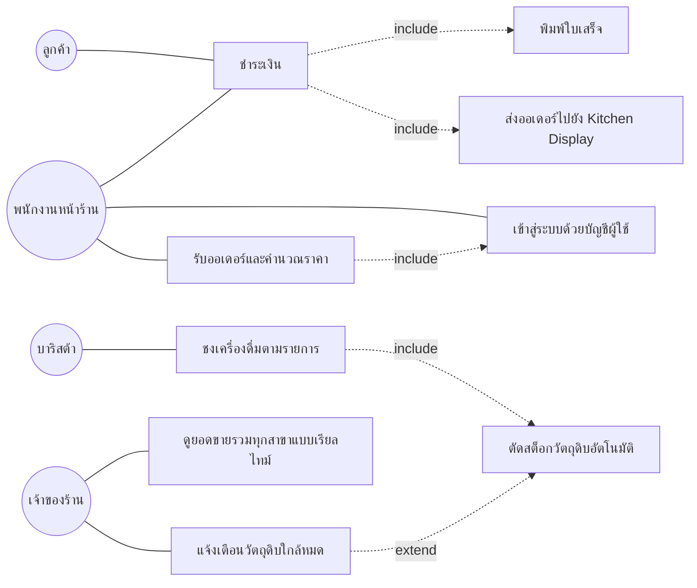

# wk04-user-stories.md

## ระบบ POS ร้านกาแฟ "Brew & Bean" — User Stories และ Use Case Diagram

อ้างอิงจาก `wk03-requirements.md` (Functional Requirements v1) และ TO-BE Process Diagram (Swimlane: ลูกค้า / พนักงาน / บาริสต้า)

---

## ส่วนที่ 1: Actor

ระบุ Actor 4 ตัว (เกินขั้นต่ำ 3 ตัว) โดยอ้างอิงจากผู้ใช้งานที่ปรากฏใน TO-BE Diagram และ Stakeholders ใน `wk03-requirements.md`

| Actor | บทบาท |
|---|---|
| ลูกค้า (Customer) | สั่งเครื่องดื่ม เลือกวิธีชำระเงิน รับเครื่องดื่มและใบเสร็จ |
| พนักงานหน้าร้าน (Staff/Cashier) | บันทึกออเดอร์ผ่าน POS, ยืนยันการชำระเงิน, เข้าสู่ระบบด้วยบัญชีของตนเอง |
| บาริสต้า (Barista) | ดูรายการเครื่องดื่มจาก Kitchen Display และชงเครื่องดื่มตามออเดอร์ |
| เจ้าของร้าน/ผู้จัดการ (Owner/Manager) | ดูยอดขายรวมทุกสาขาแบบเรียลไทม์ และรับการแจ้งเตือนวัตถุดิบใกล้หมด |

---

## ส่วนที่ 2: Use Case Diagram

### 2.1 รายการ Use Case (9 use case ครบตามขอบเขตใน `wk03-requirements.md`)

| Use Case | Actor หลัก | มาจาก FR |
|---|---|---|
| UC-01 เข้าสู่ระบบด้วยบัญชีผู้ใช้ | พนักงานหน้าร้าน | FR-09 |
| UC-02 **รับออเดอร์และคำนวณราคา** (Use Case หลักของ sprint) | พนักงานหน้าร้าน | FR-01, FR-02, FR-03 |
| UC-03 ชำระเงิน | ลูกค้า, พนักงานหน้าร้าน | (ต่อเนื่องจาก UC-02) |
| UC-04 พิมพ์ใบเสร็จ | พนักงานหน้าร้าน | FR-08 |
| UC-05 ส่งออเดอร์ไปยัง Kitchen Display | พนักงานหน้าร้าน | (ต่อเนื่องจากการชำระเงินสำเร็จ) |
| UC-06 ชงเครื่องดื่มตามรายการ | บาริสต้า | (ต่อเนื่องจาก UC-05) |
| UC-07 ตัดสต็อกวัตถุดิบอัตโนมัติ | ระบบ (Trigger จาก UC-06) | FR-04 |
| UC-08 แจ้งเตือนวัตถุดิบใกล้หมด | เจ้าของร้าน/ผู้จัดการ | FR-05 |
| UC-09 ดูยอดขายรวมทุกสาขาแบบเรียลไทม์ | เจ้าของร้าน | FR-06, FR-07 |

### 2.2 ความสัมพันธ์ Include / Extend (เกินขั้นต่ำ 1 คู่)

| ความสัมพันธ์ | Base → Included/Extending | เหตุผล |
|---|---|---|
| **Include** | UC-02 รับออเดอร์และคำนวณราคา → UC-01 เข้าสู่ระบบด้วยบัญชีผู้ใช้ | พนักงานต้อง login ทุกครั้งก่อนบันทึกออเดอร์ (mandatory) |
| **Include** | UC-03 ชำระเงิน → UC-04 พิมพ์ใบเสร็จ | ทุกครั้งที่ชำระเงินสำเร็จ ระบบต้องออกใบเสร็จเสมอ (mandatory, FR-08) |
| **Include** | UC-03 ชำระเงิน → UC-05 ส่งออเดอร์ไปยัง Kitchen Display | ทุกครั้งที่ชำระเงินสำเร็จ ออเดอร์ต้องถูกส่งให้บาริสต้าเสมอ |
| **Include** | UC-06 ชงเครื่องดื่มตามรายการ → UC-07 ตัดสต็อกวัตถุดิบอัตโนมัติ | ทุกครั้งที่ชงเครื่องดื่มเสร็จ ต้องตัดสต็อกเสมอ (mandatory, FR-04) |
| **Extend** | UC-08 แจ้งเตือนวัตถุดิบใกล้หมด ⇢ UC-07 ตัดสต็อกวัตถุดิบอัตโนมัติ | เกิดขึ้น **เฉพาะเมื่อ** ตัดสต็อกแล้วปริมาณคงเหลือต่ำกว่าเกณฑ์ที่กำหนด (optional, FR-05) — ลูกศรชี้เข้าหา UC-07 ตามทิศทาง Extend |

### 2.3 แผนภาพ (ตัวช่วยอ้างอิงก่อนวาดจริงใน StarUML)

> หมายเหตุ: Mermaid ไม่รองรับหัวลูกศรโปร่งแบบ UML generalization/extend โดยตรง ใช้ภาพนี้เป็นแนวทางเท่านั้น เมื่อวาดจริงด้วย StarUML ให้ใช้สัญลักษณ์ `<<include>>` / `<<extend>>` ตามมาตรฐาน UML และครอบทุก use case ด้วย System Boundary "ระบบ POS ร้านกาแฟ Brew & Bean"

---

## ส่วนที่ 3: Use Case Description — UC-02 รับออเดอร์และคำนวณราคา

*(Use Case หลักของ sprint ตามที่ CASE-STUDY-COFFEE-SHOP-STD.md กำหนด — จะถูกใช้ต่อยอดใน Coding Sprint 1 สัปดาห์ที่ 5 และ Class Diagram สัปดาห์ที่ 6)*

| หัวข้อ | รายละเอียด |
|---|---|
| **Actor** | พนักงานหน้าร้าน (primary), ลูกค้า (secondary — เป็นผู้บอกเมนูที่ต้องการ) |
| **Precondition** | 1) พนักงานเข้าสู่ระบบด้วยบัญชีผู้ใช้ของตนเองแล้ว (UC-01) 2) ข้อมูลเมนู ราคา และท็อปปิ้งถูกตั้งค่าไว้ในระบบแล้ว |

**Main Flow:**
1. ลูกค้าเข้าร้านและบอกเมนูที่ต้องการกับพนักงาน
2. พนักงานเลือกเมนูผ่านหน้าจอ POS แบบกดเลือก (FR-01)
3. พนักงานเพิ่มท็อปปิ้ง/ตัวเลือกเพิ่มเติมตามที่ลูกค้าสั่ง (FR-02)
4. ระบบคำนวณราคารวมของออเดอร์โดยอัตโนมัติ รวมส่วนเพิ่มจากท็อปปิ้ง (FR-03)
5. พนักงานยืนยันรายการออเดอร์กับลูกค้าอีกครั้งก่อนส่งไปขั้นตอนชำระเงิน
6. ระบบบันทึกออเดอร์ไว้ในสถานะ "รอชำระเงิน"

**Alternative Flow:**
- 3a. ลูกค้าสั่งมากกว่า 1 เมนูในออเดอร์เดียว → พนักงานเพิ่มเมนูถัดไป แล้ววนกลับไปทำขั้นตอนที่ 2–4 จนครบทุกเมนู จากนั้นดำเนินการต่อที่ขั้นตอนที่ 5

**Exception Flow:**
- 2a. เมนูที่ลูกค้าต้องการหมดสต็อกชั่วคราว → ระบบแสดงข้อความ "เมนูนี้หมดชั่วคราว" และไม่อนุญาตให้เลือกเมนูนั้น
- 4a. ระบบคำนวณราคาไม่สำเร็จ (เช่น ข้อมูลราคาของเมนูไม่ครบในระบบ) → ระบบแสดงข้อความแจ้งข้อผิดพลาด และไม่บันทึกออเดอร์จนกว่าพนักงานจะแก้ไขข้อมูลราคา

| หัวข้อ | รายละเอียด |
|---|---|
| **Postcondition** | สำเร็จ: มีออเดอร์สถานะ "รอชำระเงิน" พร้อมราคารวมที่ถูกต้อง / ไม่สำเร็จ: ยังไม่มีออเดอร์ถูกสร้าง พร้อมข้อความ error แสดงบนหน้าจอ |

---

## ส่วนที่ 4: User Stories + Acceptance Criteria

*แปลงจาก Functional Requirement ในสัปดาห์ที่ 3 และจาก Main/Alternative/Exception Flow ของ UC-02 ด้านบน (เส้นทาง 2 ตามหัวข้อ 3.1 ของเอกสารสัปดาห์ 4) รวม 9 เรื่อง (เกินขั้นต่ำ 6 เรื่อง) แต่ละเรื่องมี Acceptance Criteria อย่างน้อย 2 ข้อ*

### US-01: บันทึกออเดอร์และคำนวณราคาอัตโนมัติ (Main Flow ของ UC-02)
**As a** พนักงานหน้าร้าน
**I want** เลือกเมนูและท็อปปิ้งผ่านหน้าจอ POS พร้อมให้ระบบคำนวณราคารวมอัตโนมัติ
**So that** ลดความผิดพลาดจากการจดออเดอร์ด้วยมือ โดยเฉพาะช่วงเวลาเร่งด่วน

- Given พนักงานเลือกเมนู "ลาเต้ร้อน" และเพิ่มท็อปปิ้ง "ชอตเอสเปรสโซ่เพิ่ม" 1 รายการ, When พนักงานกดยืนยันออเดอร์, Then ระบบต้องคำนวณราคารวมที่รวมส่วนเพิ่มจากท็อปปิ้งถูกต้อง และบันทึกออเดอร์เป็นสถานะ "รอชำระเงิน"
- Given ลูกค้าสั่ง 2 เมนูในออเดอร์เดียวกัน, When พนักงานเพิ่มเมนูที่สองเข้าไปในออเดอร์เดิม, Then ระบบต้องรวมราคาทั้ง 2 เมนูเป็นยอดเดียวโดยไม่แยกเป็นคนละออเดอร์

*INVEST: Independent (แยกพัฒนาจากขั้นชำระเงินได้) / Negotiable (UI ปุ่มเลือกเมนูปรับได้) / Valuable (ลดออเดอร์ผิดพลาด) / Estimable (scope ชัดเจน) / Small (เฉพาะขั้นตอนบันทึกออเดอร์ ไม่รวมชำระเงิน) / Testable (มี AC แบบ Given-When-Then)*

### US-02: แจ้งเตือนเมื่อเมนูหมดสต็อกชั่วคราว (Exception Flow 2a ของ UC-02)
**As a** พนักงานหน้าร้าน
**I want** เห็นข้อความแจ้งเตือนทันทีเมื่อเมนูที่ลูกค้าเลือกหมดสต็อกชั่วคราว
**So that** แจ้งลูกค้าให้เปลี่ยนเมนูอื่นได้ทันทีโดยไม่เสียเวลา

- Given เมนู "มัทฉะลาเต้" มีสถานะ "หมดชั่วคราว" ในระบบ, When พนักงานพยายามเลือกเมนูนี้บนหน้าจอ POS, Then ระบบต้องแสดงข้อความ "เมนูนี้หมดชั่วคราว" และไม่อนุญาตให้เพิ่มเมนูนี้ลงในออเดอร์
- Given ระบบคำนวณราคาไม่สำเร็จเพราะข้อมูลราคาของเมนูไม่ครบ, When พนักงานกดยืนยันออเดอร์, Then ระบบต้องแสดงข้อความแจ้งข้อผิดพลาดและไม่บันทึกออเดอร์

*INVEST: Independent / Negotiable (ข้อความแจ้งเตือนปรับได้) / Valuable (ป้องกันลูกค้ารอเมนูที่ทำไม่ได้จริง) / Estimable / Small (เฉพาะ exception flow เดียว) / Testable*

### US-03: เข้าสู่ระบบด้วยบัญชีผู้ใช้ของตนเอง (FR-09, UC-01)
**As a** พนักงานหน้าร้าน
**I want** เข้าสู่ระบบด้วยบัญชีผู้ใช้ของตนเองก่อนเริ่มบันทึกออเดอร์
**So that** เจ้าของร้านตรวจสอบย้อนหลังได้ว่าใครรับออเดอร์ตอนไหน

- Given พนักงานกรอกชื่อผู้ใช้และรหัสผ่านที่ถูกต้อง, When กดเข้าสู่ระบบ, Then ระบบต้องอนุญาตให้เข้าสู่หน้าจอบันทึกออเดอร์ได้
- Given พนักงานยังไม่ได้เข้าสู่ระบบ, When พยายามเปิดหน้าจอบันทึกออเดอร์โดยตรง, Then ระบบต้องปฏิเสธและให้กลับไปหน้าเข้าสู่ระบบก่อน

*INVEST: Independent / Negotiable / Valuable (ตรวจสอบย้อนหลังได้) / Estimable / Small / Testable*

### US-04: ชำระเงินได้หลายช่องทาง (ต่อเนื่องจาก UC-03)
**As a** ลูกค้า
**I want** เลือกชำระเงินได้ทั้งเงินสดและ QR/บัตร
**So that** จ่ายเงินด้วยวิธีที่สะดวกสำหรับตนเอง

- Given ยอดชำระของออเดอร์คือ 120 บาท, When ลูกค้าเลือกชำระด้วยเงินสดและพนักงานยืนยันรับเงินครบ, Then ระบบต้องเปลี่ยนสถานะออเดอร์เป็น "ชำระเงินแล้ว"
- Given ลูกค้าเลือกชำระผ่าน QR/บัตร, When ระบบยืนยันธุรกรรมสำเร็จจากผู้ให้บริการชำระเงิน, Then ระบบต้องเปลี่ยนสถานะออเดอร์เป็น "ชำระเงินแล้ว" เช่นเดียวกับการชำระเงินสด

*INVEST: Independent / Negotiable (ผู้ให้บริการ QR/บัตรเลือกได้ภายหลัง) / Valuable / Estimable / Small / Testable*

### US-05: ออกใบเสร็จได้ทั้งกระดาษและดิจิทัล (FR-08)
**As a** ลูกค้า
**I want** ได้รับใบเสร็จได้ทั้งแบบพิมพ์กระดาษและแบบดิจิทัล (QR Code)
**So that** เลือกรูปแบบใบเสร็จที่สะดวกสำหรับตนเอง

- Given ออเดอร์ชำระเงินสำเร็จแล้ว, When ลูกค้าเลือกรับใบเสร็จแบบกระดาษ, Then ระบบต้องสั่งพิมพ์ใบเสร็จออกทางเครื่องพิมพ์ทันที
- Given ออเดอร์ชำระเงินสำเร็จแล้ว, When ลูกค้าเลือกรับใบเสร็จแบบดิจิทัล, Then ระบบต้องสร้าง QR Code ใบเสร็จให้ลูกค้าสแกนรับแทนการพิมพ์กระดาษ

*INVEST: Independent / Negotiable / Valuable / Estimable / Small / Testable*

### US-06: ส่งออเดอร์ไปยัง Kitchen Display หลังชำระเงินสำเร็จ
**As a** บาริสต้า
**I want** เห็นรายการเครื่องดื่มที่ต้องชงบนจอ Kitchen Display ทันทีหลังลูกค้าชำระเงินสำเร็จ
**So that** เริ่มชงเครื่องดื่มได้ทันทีโดยไม่พลาดออเดอร์

- Given ออเดอร์เพิ่งเปลี่ยนสถานะเป็น "ชำระเงินแล้ว", When ระบบส่งออเดอร์ไปยัง Kitchen Display, Then รายการเครื่องดื่มพร้อมท็อปปิ้งต้องปรากฏบนจอบาริสต้าภายในไม่กี่วินาที
- Given บาริสต้ากดยืนยันว่าชงเครื่องดื่มเสร็จแล้ว, When ระบบอัปเดตสถานะออเดอร์, Then สถานะออเดอร์ต้องเปลี่ยนเป็น "พร้อมเสิร์ฟ" และรายการต้องหายไปจากคิวที่ต้องทำ

*INVEST: Independent / Negotiable / Valuable / Estimable / Small / Testable*

### US-07: ตัดสต็อกวัตถุดิบอัตโนมัติ (FR-04)
**As a** ผู้จัดการร้าน
**I want** ให้ระบบตัดสต็อกวัตถุดิบตามสูตรของเมนูโดยอัตโนมัติทันทีที่ชงเครื่องดื่มเสร็จ
**So that** ข้อมูลสต็อกวัตถุดิบถูกต้องอยู่เสมอโดยไม่ต้องนับด้วยมือ

- Given เมนู "ลาเต้ร้อน" ใช้นม 200 มล. ต่อแก้วตามสูตร, When บาริสต้ากดยืนยันว่าชงเครื่องดื่มเสร็จ, Then ระบบต้องตัดสต็อกนมออกจากคลัง 200 มล. ทันที
- Given ออเดอร์มี 2 เมนูที่ใช้วัตถุดิบร่วมกัน (เช่น นม), When ชงเครื่องดื่มทั้ง 2 แก้วเสร็จ, Then ระบบต้องตัดสต็อกรวมของวัตถุดิบนั้นให้ถูกต้องตามจำนวนที่ใช้จริงทั้งหมด

*INVEST: Independent / Negotiable / Valuable / Estimable / Small / Testable*

### US-08: แจ้งเตือนวัตถุดิบใกล้หมด (FR-05, Extend จาก UC-07)
**As a** ผู้จัดการร้าน
**I want** ได้รับการแจ้งเตือนเมื่อวัตถุดิบเหลือต่ำกว่าจำนวนที่กำหนด
**So that** สั่งซื้อวัตถุดิบเพิ่มได้ทันเวลา ไม่ต้องรอให้ของหมดก่อนถึงจะรู้

- Given นมคงเหลือในคลังคือ 2,100 มล. และเกณฑ์แจ้งเตือนตั้งไว้ที่ 2,000 มล., When ระบบตัดสต็อกนมจากออเดอร์ล่าสุดจนเหลือต่ำกว่า 2,000 มล., Then ระบบต้องส่งการแจ้งเตือนไปยังหน้าจอผู้จัดการทันที
- Given วัตถุดิบชนิดหนึ่งยังเหลือมากกว่าเกณฑ์ที่กำหนด, When ระบบตัดสต็อกวัตถุดิบนั้นตามปกติ, Then ระบบต้องไม่ส่งการแจ้งเตือนใดๆ

*INVEST: Independent / Negotiable (ตั้งค่าเกณฑ์แจ้งเตือนปรับได้) / Valuable / Estimable / Small / Testable*

### US-09: ดูยอดขายรวมทุกสาขาแบบเรียลไทม์ (FR-06, FR-07)
**As a** เจ้าของร้าน
**I want** ดูยอดขายรวมของทุกสาขาแบบเรียลไทม์ผ่านหน้าจอสรุปผล
**So that** ติดตามผลประกอบการและตัดสินใจทางธุรกิจได้ทันเวลา

- Given สาขา A และสาขา B มีออเดอร์ที่ชำระเงินสำเร็จวันนี้ 50 และ 30 รายการตามลำดับ, When เจ้าของร้านเปิดหน้าจอสรุปยอดขาย, Then ระบบต้องแสดงยอดขายรวมของทั้ง 2 สาขาตรงกับผลรวมของออเดอร์ทั้งหมด
- Given มีออเดอร์ใหม่ชำระเงินสำเร็จที่สาขา A, When ข้อมูลถูกส่งไปยังระบบส่วนกลาง, Then ยอดขายรวมบนหน้าจอสรุปผลของเจ้าของร้านต้องอัปเดตโดยไม่ต้องรีเฟรชหน้าด้วยมือ

*INVEST: Independent / Negotiable (รูปแบบกราฟ/ตารางปรับได้) / Valuable / Estimable / Small / Testable*

---

## สรุปความครอบคลุม

- Acceptance Criteria ของ UC-02 (Use Case หลัก) ครอบคลุมทั้ง **Main Flow** (US-01) และ **Exception Flow** (US-02) ตามที่กำหนดไว้ในขั้นตอนที่ 5 ของ Workshop
- User Story ทั้ง 9 เรื่องสอดคล้องกับ Functional Requirement FR-01 ถึง FR-09 ใน `wk03-requirements.md` ครบทุกข้อ
- ทุกเรื่องผ่านการตรวจสอบตามหลัก INVEST แล้ว ไม่มีเรื่องใดต้องปรับแก้เพิ่มเติม
