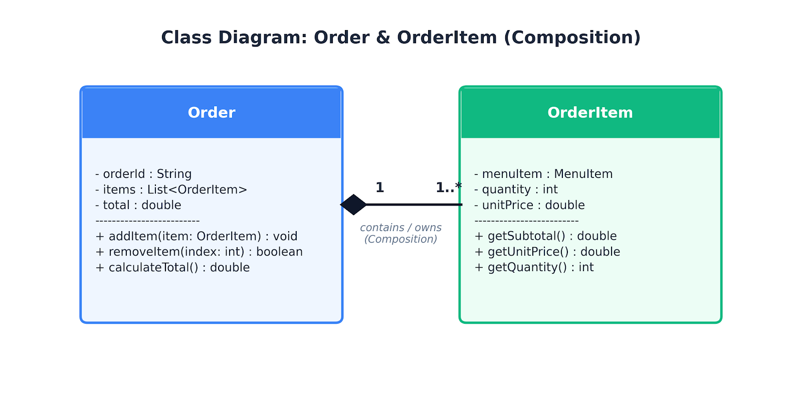
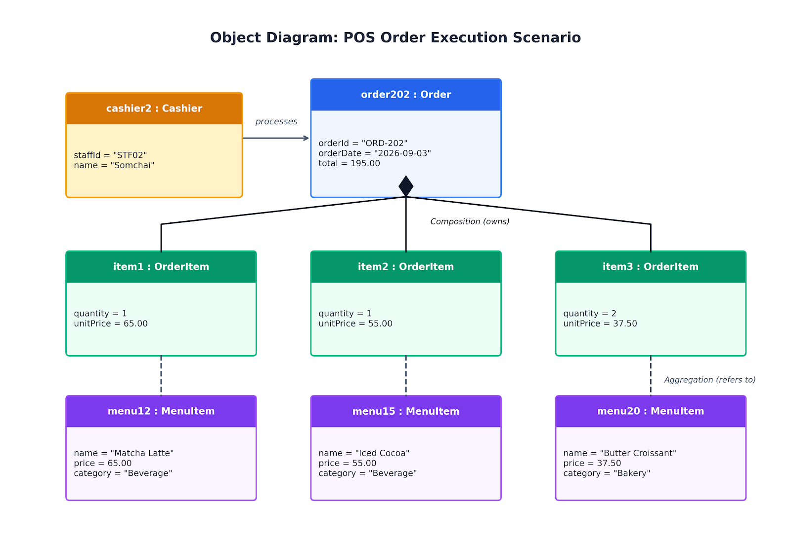

# สัปดาห์ที่ 6: รายงานวัดผล CLO1 (รายบุคคล)
**ชื่องาน:** อธิบายเหตุผลของความสัมพันธ์ระหว่าง Class และตรวจสอบความสอดคล้องระหว่าง Diagram กับโค้ด  
**วิชา:** การออกแบบเชิงวัตถุและสถาปัตยกรรมซอฟต์แวร์ (Object-Oriented Design)

---

## 1. Class Diagram ระหว่าง Order กับ OrderItem และเหตุผลของความสัมพันธ์ (Composition)

### 1.1 Mini Class Diagram


```text
+-----------------------------------+                       +-------------------------------+
|               Order               | 1                   * |           OrderItem           |
+-----------------------------------+ ◆-------------------->+-------------------------------+
| - orderId : String                | (Composition)         | - menuItem : MenuItem         |
| - items : List<OrderItem>         |                       | - quantity : int              |
| - total : double                  |                       | - unitPrice : double          |
+-----------------------------------+                       +-------------------------------+
| + addItem(item: OrderItem) : void |                       | + getSubtotal() : double      |
| + removeItem(index: int) : boolean|                       | + getUnitPrice() : double     |
| + calculateTotal() : double       |                       | + getQuantity() : int         |
+-----------------------------------+                       +-------------------------------+
```

### 1.2 เหตุผลที่ต้องเป็น Composition และผลกระทบหากออกแบบผิด
1. **การขึ้นตรงต่อวงจรชีวิต (Lifecycle Dependency):**
   * `OrderItem` มีสถานะเป็น **ชิ้นส่วนย่อย (Part)** ของ `Order` ที่เป็น **องค์รวม (Whole)** โดย `OrderItem` ไม่มีตัวตนทางธุรกิจหรือคุณค่าในการทำงานได้ด้วยตัวเองหากปราศจาก `Order` ที่เป็นเจ้าของ
   * ในโค้ดตัวอย่าง (หัวข้อ 3.2) คลาส `Order` เป็นผู้สร้าง เก็บรักษา (`this.items`) และควบคุม `OrderItem` ไว้ภายในตัวเองทั้งหมด
2. **ผลกระทบหากออกแบบผิดเป็น Aggregation:**
   * หากออกแบบเป็น Aggregation เมื่อเกิดเหตุการณ์ **"ลบหรือยกเลิก Order"** แต่ `OrderItem` ยังคงดำรงอยู่และไม่ถูกลบตาม (ไม่เกิด Cascade Delete) จะทำให้เกิด **"ข้อมูลกำพร้า (Orphan Records)"** ค้างอยู่ในระบบ
   * ข้อมูลกำพร้าเหล่านี้จะส่งผลกระทบโดยตรงต่อระบบ POS ร้านกาแฟ เช่น รายงานสรุปยอดขาย (Sales Report) จะดึงรายการสินค้าที่ไม่ผูกกับบิลใดๆ มานับซ้ำ หรือทำให้ยอดสต็อกวัตถุดิบและยอดรายรับคลาดเคลื่อน ไม่ตรงกับบิลจริง

---

## 2. ความสัมพันธ์ระหว่าง OrderItem กับ MenuItem (Aggregation)

### 2.1 เหตุผลที่ต้องเป็น Aggregation
1. **ความเป็นอิสระของวงจรชีวิต (Independent Lifecycle):**
   * `MenuItem` (เช่น "Matcha Latte", "Espresso") ถือเป็นข้อมูลหลัก (Master Data) ของร้าน ซึ่งดำรงอยู่ได้อย่างอิสระโดยไม่ขึ้นกับ `OrderItem` แม้จะยังไม่มีลูกค้าสั่งซื้อเมนูนั้นเลย หรือเมื่อปิดรอบบิลและลบออเดอร์ของวันนั้นทิ้ง ข้อมูลเมนูก็ยังคงอยู่ในระบบของร้านกาแฟ
2. **การถูกอ้างอิงร่วมกัน (Shared Reference):**
   * `MenuItem` หนึ่งรายการ สามารถถูกอ้างอิงพร้อมกันโดย `OrderItem` หลายรายการจากหลายๆ ออเดอร์ของลูกค้าหลายคนได้

### 2.2 ผลกระทบหากออกแบบผิดเป็น Composition และการทำ Snapshot ราคา
* **ผลกระทบจากการเป็น Composition:**
   * หากออกแบบเป็น Composition เมื่อมีการลบ `OrderItem` หรือยกเลิกออเดอร์ ระบบจะพาลบ `MenuItem` ออกจากระบบร้านไปด้วย หรือในทางกลับกัน **หากผู้จัดการร้านลบเมนูที่เลิกขายทั่วไป (Discontinued)** ประวัติออเดอร์เก่าย้อนหลังที่เคยสั่งเมนูนั้นจะเกิดข้อผิดพลาดทันที (ข้อมูลสูญหาย หรือเกิดข้อผิดพลาด Null Pointer)
* **การ Snapshot ราคา (Data Integrity):**
   * จากโค้ดหัวข้อ 3.2 มีการใช้ `this.unitPrice = item.price` แม้จะเชื่อมโยงแบบ Aggregation แต่ `OrderItem` จำเป็นต้องคัดลอก (Snapshot) ราคา ณ ขณะที่สั่งซื้อเก็บไว้ในตัวเอง เพื่อไม่ให้ยอดรวมในประวัติออเดอร์เก่าเปลี่ยนแปลงเมื่อร้านมีการปรับราคาเมนูใหม่ในอนาคต

---

## 3. การเพิ่ม Method `removeItem(index)` ตามหลัก Encapsulation

### 3.1 โค้ด Method ในคลาส Order
```javascript
/**
 * ลบรายการสินค้าออกจากออเดอร์ตาม index ที่ระบุ
 * @param {number} index - ลำดับของรายการสินค้าในอาร์เรย์ที่ต้องการลบ (0-based)
 * @returns {boolean} - คืนค่า true หากลบสำเร็จ, false หาก index ไม่ถูกต้อง
 */
removeItem(index) {
  // 1. ตรวจสอบความถูกต้องและขอบเขตของ index (Boundary Validation)
  if (typeof index !== 'number' || index < 0 || index >= this.items.length) {
    return false;
  }

  // 2. ดำเนินการลบรายการออกจากอาเรย์ภายใน
  this.items.splice(index, 1);

  // 3. รักษาความสอดคล้องของ State ภายใน (Recalculate internal state)
  this.calculateTotal();

  return true;
}
```

### 3.2 เหตุผลเชิงหลักการ Encapsulation (หัวข้อ 1.1)
* **การปกป้อง State และรักษาความสอดคล้องของข้อมูล (Information Hiding & Integrity):**
  * หากให้ Controller เข้าถึง `order.items` โดยตรง เช่น `order.items.splice(i, 1)` จะทำให้ภายนอกสามารถยัดเยียดหรือลบข้อมูลโดยไม่ผ่านการตรวจสอบ (Bypass Validation) และทำให้ตัวแปรยอดรวม `total` ไม่ได้รับการอัปเดต ส่งผลให้ข้อมูลภายในของ Order ไม่สอดคล้องกัน (Inconsistent State)
* **ลดการผูกมัด (Low Coupling):**
  * การรวม Logic ไว้ใน Method ของคลาส `Order` ทำให้ Controller ไม่จำเป็นต้องรู้ว่าภายใน `Order` เก็บรายการสินค้าด้วย Array, Map หรือ Set หากมีการเปลี่ยนโครงสร้างข้อมูลภายใน จะแก้ไขเพียงแค่ภายในคลาส `Order` โดยไม่กระทบ Controller ภายนอก

---

## 4. Object Diagram สถานการณ์ใหม่และการสะท้อนกฎ

### 4.1 รายละเอียดสถานการณ์ใหม่ (Custom Scenario)
* **จุดที่แตกต่างจากเอกสารอย่างน้อย 2 จุด:**
  1. **พนักงานและออเดอร์ใหม่:** พนักงานแคชเชียร์ชื่อ `cashier2 : Cashier` (Somchai) กำลังประมวลผลออเดอร์ใหม่ `order202 : Order` ยอดรวม 195.00 บาท
  2. **จำนวนรายการและประเภทเมนูต่างไป:** มี **3 รายการ (3 OrderItems)** ประกอบด้วยเมนูที่แตกต่างอย่างสิ้นเชิง คือ ชาเขียวมัทฉะลาเต้, โกโก้เย็น และครัวซองต์เนยสด

### 4.2 Object Diagram


```text
+-----------------------------+
|    cashier2 : Cashier       |
+-----------------------------+
| staffId = "STF02"           |
| name = "Somchai"            |
+-----------------------------+
               |
               | processes
               v
+-----------------------------+
|      order202 : Order       |
+-----------------------------+
| orderId = "ORD-202"         |
| orderDate = "2026-09-03"    |
| total = 195.00              |
+-----------------------------+
     |             |             |
     | (comp)      | (comp)      | (comp)
     v             v             v
+--------------+ +--------------+ +--------------+
|item1:OrderItem| |item2:OrderItem| |item3:OrderItem|
+--------------+ +--------------+ +--------------+
|quantity = 1  | |quantity = 1  | |quantity = 2  |
|unitPrice=65.0| |unitPrice=55.0| |unitPrice=37.5|
+--------------+ +--------------+ +--------------+
        |                |                |
        | (agg)          | (agg)          | (agg)
        v                v                v
+--------------+ +--------------+ +--------------+
|menu12:MenuItem| |menu15:MenuItem| |menu20:MenuItem|
+--------------+ +--------------+ +--------------+
|name="Matcha" | |name="Cocoa"  | |name="Croiss" |
|price = 65.00 | |price = 55.00 | |price = 37.50 |
+--------------+ +--------------+ +--------------+
```

### 4.3 การสะท้อนกฎ Composition และ Aggregation จาก Instance จริง
1. **การสะท้อนกฎ Composition (`order202` กับ `item1, item2, item3`):**
   * อินสแตนซ์ `item1`, `item2`, และ `item3` เกิดขึ้นมาเพื่อเป็นส่วนหนึ่งของ `order202` เท่านั้น หากแคชเชียร์ทำการกดยกเลิกบิล `order202` อินสแตนซ์ของ `item1`, `item2`, และ `item3` ทั้ง 3 ตัวจะต้องถูกทำลายทิ้งไปพร้อมกับ `order202` ทันที ไม่สามารถคงอยู่เดี่ยวๆ ในหน่วยความจำได้
2. **การสะท้อนกฎ Aggregation (`item1..3` กับ `menu12, menu15, menu20`):**
   * อินสแตนซ์ `menu12 (Matcha Latte)`, `menu15 (Iced Cocoa)`, และ `menu20 (Butter Croissant)` มีวงจรชีวิตเป็นอิสระ แม้ `order202` และรายการสินค้าทั้ง 3 จะถูกทำลายไป แต่อินสแตนซ์ของ `menu12`, `menu15`, และ `menu20` จะยังคงอยู่บนเมนูบอร์ดของร้าน POS เพื่อรอให้ออเดอร์อื่นอ้างอิงต่อไป
