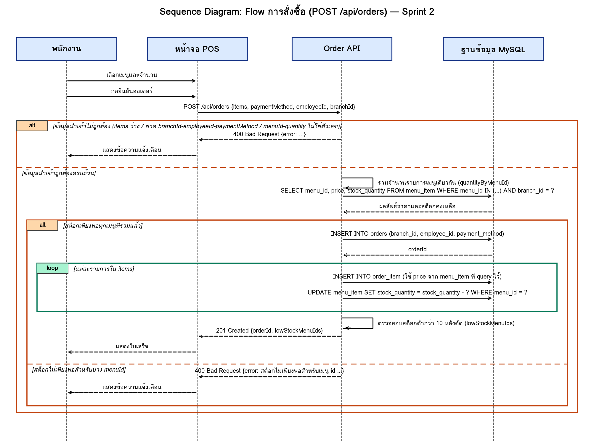
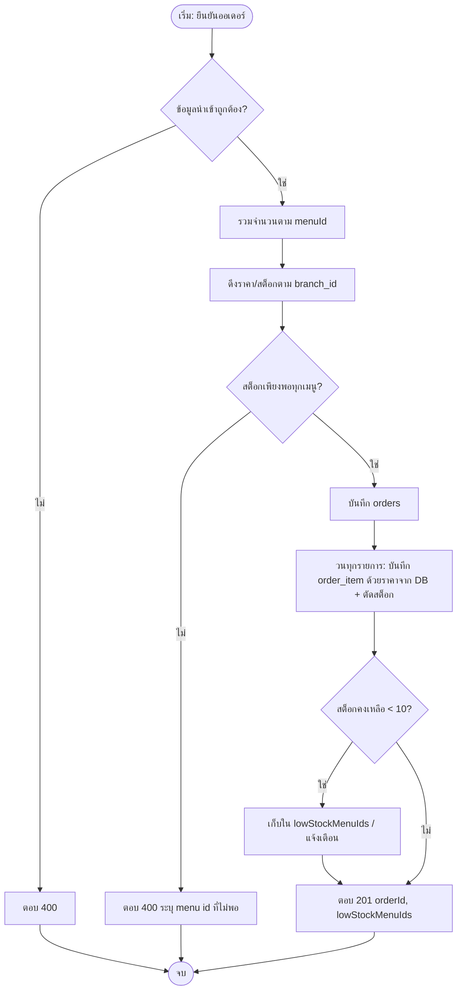

# Workshop สัปดาห์ที่ 9 — ผลงานกลุ่ม

ไฟล์นี้เป็นเอกสารประกอบ (Sequence Diagram อยู่ในไฟล์ `wk09-sequence-diagram.png`)  
> ต้องปรับชื่อตาราง/คอลัมน์/สาขา ให้ตรงกับระบบของกลุ่มก่อนส่ง

## 1. Sequence Diagram

เป็นไปตามเกณฑ์: participant 4 ตัว (พนักงาน, หน้าจอ POS, Order API, ฐานข้อมูล), alt 2 ชั้นซ้อน (validation → สต็อก), loop 1 จุด (รายการใน items)

## 2. Business Rule (≥ 3 ข้อ)
1. ถ้าจำนวนที่สั่งมากกว่าสต็อกคงเหลือ (รวมจำนวนเมนูเดียวกันทุกบรรทัดก่อน) ระบบปฏิเสธออเดอร์ทั้งใบด้วย 400
2. เมื่อยืนยันออเดอร์สำเร็จ ระบบตัดสต็อกทันที
3. ถ้าสต็อกเหลือน้อยกว่า 10 หลังตัด ระบบแจ้งเตือนเจ้าของร้าน (Sprint 2: ส่ง `lowStockMenuIds` กลับ + `console.warn`)
4. ราคาต่อหน่วยต้องดึงจาก `menu_item.price` เสมอ ห้ามรับจาก client
5. ทุก query ต้องกรองด้วย `branch_id` (ป้องกัน IDOR)

## 3. Flowchart

## 4. ตารางจับคู่โค้ด ↔ Diagram (หัวข้อ 4.2)

| โค้ด (`createOrder`) | Diagram |
|---|---|
| `!Array.isArray(items) \|\| items.length === 0` | alt นอก: ข้อมูลไม่ถูกต้อง → 400 |
| `!branchId \|\| !employeeId \|\| !paymentMethod` | alt นอก: ข้อมูลไม่ถูกต้อง → 400 |
| `hasInvalidItem` | alt นอก: ข้อมูลไม่ถูกต้อง → 400 |
| `quantityByMenuId` | API→API รวมจำนวน |
| `menuModel.findManyForStockCheck` | API→DB SELECT |
| `!menu \|\| menu.stock_quantity < totalQuantity` | alt ใน: สต็อกไม่พอ → 400 |
| `orderModel.create` | API→DB INSERT orders |
| `for (const item of items)` | loop: INSERT order_item + UPDATE |
| `lowStockMenuIds` | API→API ตรวจสต็อกต่ำ |
| `res.status(201).json(...)` | API→UI 201 Created |

## 5. จุดที่ควรระวัง / บันทึก Drift
- **`menu.stock_quantity` ใน `lowStockMenuIds`**: โค้ดตัวอย่างคำนวณจากค่าที่ query ไว้ก่อนตัด ลบ `totalQuantity` จึงถูกต้อง
- **`deductStock` กรองด้วย `menu_id` อย่างเดียว**: ปลอดภัยเพราะ menuId ผ่านการกรอง branch มาแล้ว แต่ถ้าต้องการเข้มงวด ให้เพิ่ม `AND branch_id = ?`
- **ไม่มี transaction**: INSERT/UPDATE หลายคำสั่งแยกกัน ถ้าล้มกลางทางจะได้ข้อมูลครึ่งๆ กลางๆ และเกิด race condition ได้ (คำถามท้ายบทข้อ 6)
- **ลบเมนูที่ถูกอ้างใน `order_item`**: `DELETE` อาจชนกับ foreign key ควรทดสอบ

## 6. กรณีทดสอบ

| # | กรณี | ผลที่คาดหวัง |
|---|---|---|
| 1 | items ว่าง | 400 |
| 2 | quantity เป็น string `"2"` | 400 |
| 3 | สต็อกพอ | 201, สต็อกลดลง |
| 4 | สต็อกไม่พอ | 400, ไม่มี order ถูกสร้าง |
| 5 | Latte 2 บรรทัด (รวมเกินสต็อก) | 400 |
| 6 | สต็อกหลังตัด < 10 | 201 พร้อม `lowStockMenuIds` |
| 7 | ส่ง menuId ของสาขาอื่น | 400 |
| 8 | PUT/DELETE menu ของสาขาอื่น | 404 |
| 9 | ส่ง `unitPrice` ปลอมมาใน body | ถูกเมินเฉย ใช้ราคาจาก DB |
